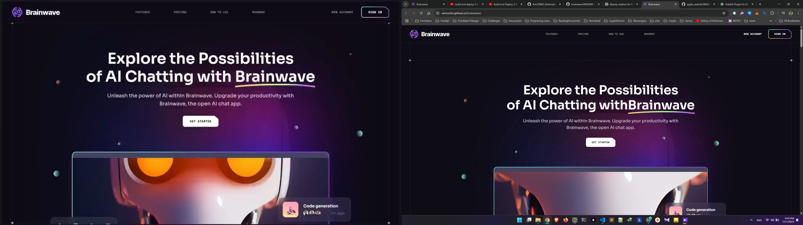
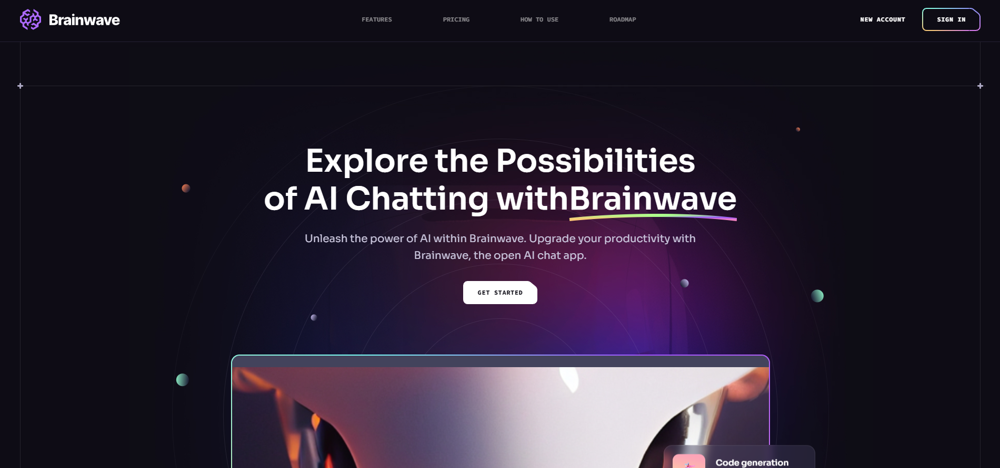
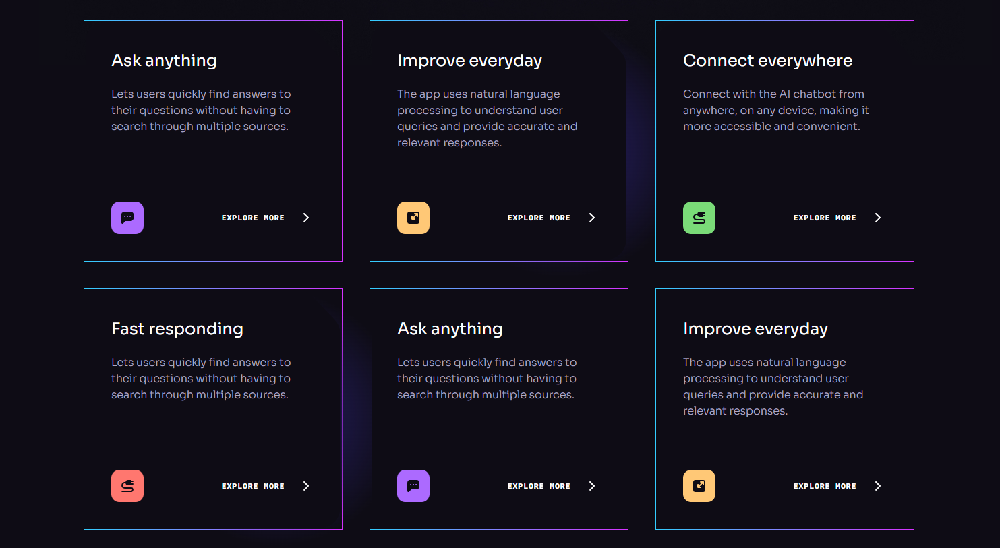

# 🧠 Brainwave

Welcome to **Brainwave** — a modern React project powered by [Vite](https://vitejs.dev/)!  
This starter template is designed for rapid prototyping and scalable development, featuring blazing fast HMR, a highly customizable ESLint setup, and everything you need to kickstart your next big idea.

🔗 **Live Preview:** [https://amirznbz.github.io/brainwave/](https://amirznbz.github.io/brainwave/)

---

## ⚙️ Tech Stack

- **React 19**
- **Vite 7**
- **Tailwind CSS 3**

---

## 🚀 Features

- **Instant Hot Module Replacement (HMR):** Lightning-fast feedback during development.
- **Minimal & Clean Setup:** Focus on building, not configuring.
- **ESLint PreConfigured:** Enforced best practices and code quality out-of-the-box.
- **Plugin Support:**
  - [@vitejs/plugin-react](https://github.com/vitejs/vite-plugin-react/blob/main/packages/plugin-react) — Babel-powered Fast Refresh.
  - [@vitejs/plugin-react-swc](https://github.com/vitejs/vite-plugin-react/blob/main/packages/plugin-react-swc) — SWC-powered Fast Refresh.

---

## 🏗️ Development

To run the project locally:

```bash
git clone https://github.com/AmirZNBZ/brainwave.git
cd brainwave
npm install
npm run dev
```

Start the development server:

```bash
npm run dev
```

Open [http://localhost:5173](http://localhost:5173) to view your app.

---

## 📦 Deployment

```bash
npm run build
npm run deploy
```

## 📁 Folder Structure

public/
src/
├── assets/
├── components/
├── constants/

## ✍️ Author

Made with ❤️






